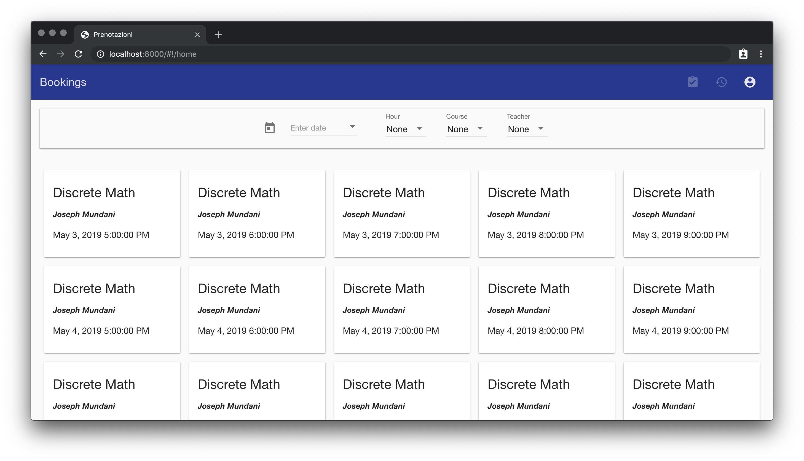
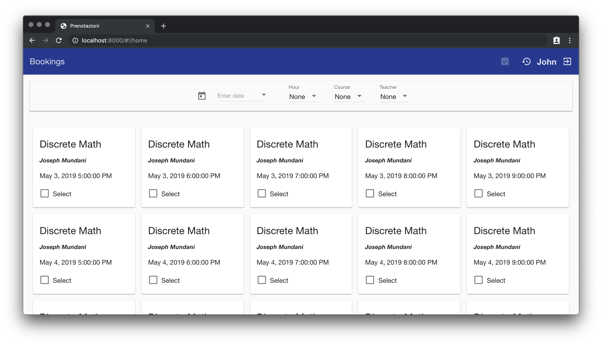
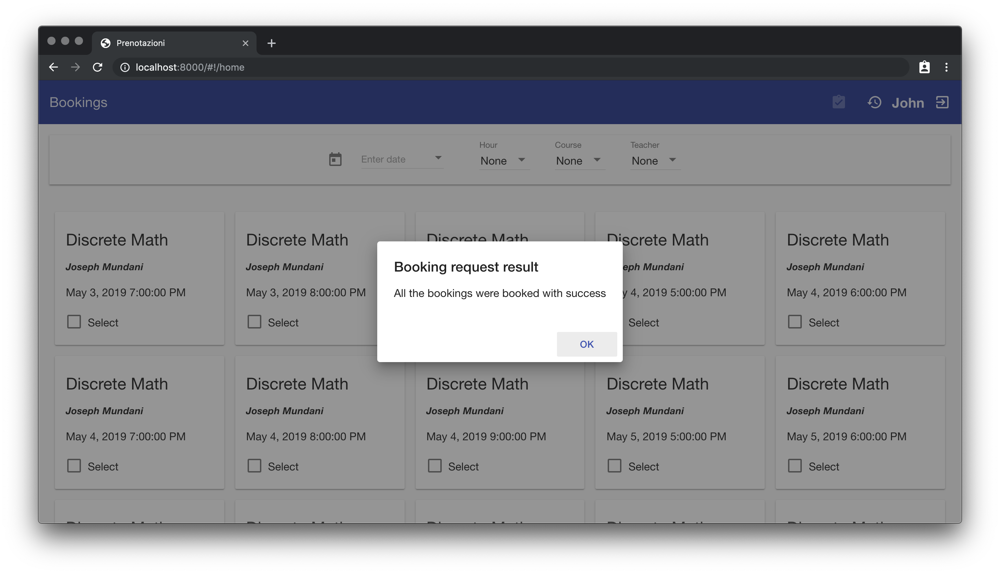
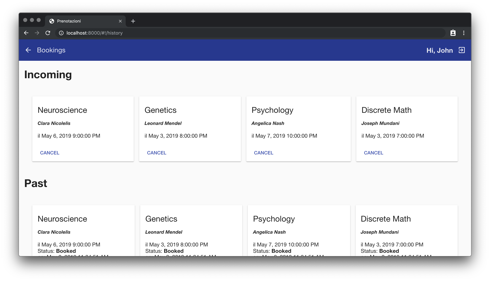
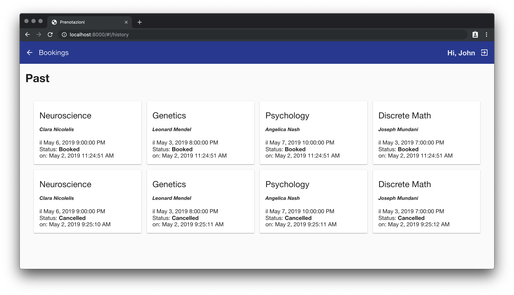
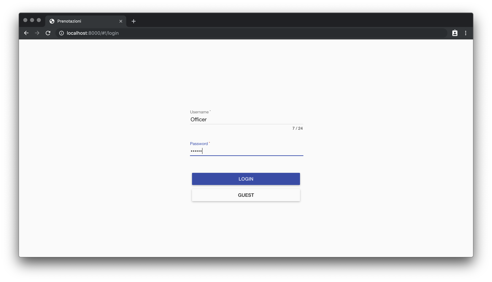
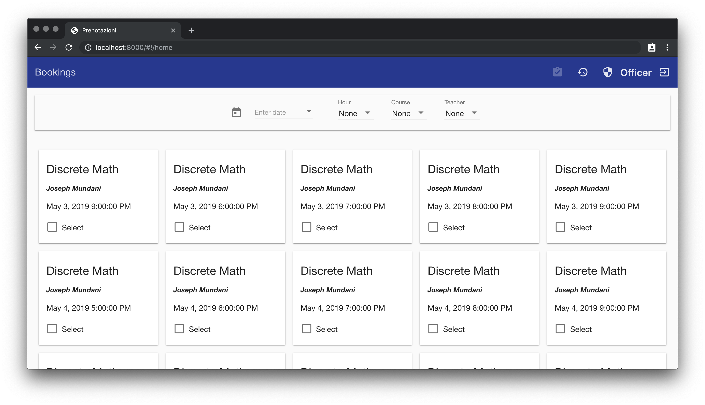
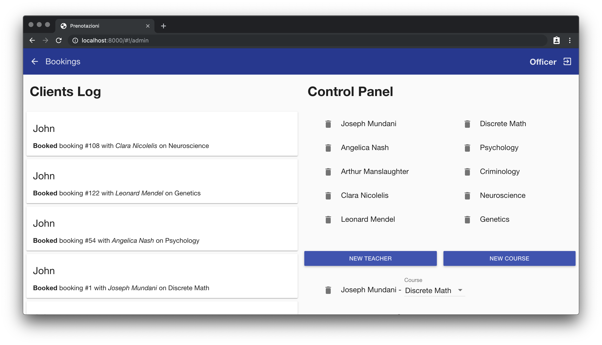
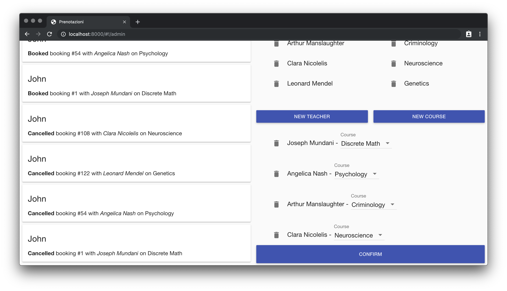

# Web bookings
2018/2019 Web technologies university project made with angularjs + java servlet.

# How to start
Start tomcat and mysql, you may need to tweak parameters in `src/st169656/dao/BookingsImplementation.java` then:

```bash
cd bookings/
npm install && npm run start
```

# Screenshots











# License
```
Copyright (C) 2022 Luca D'Amato

This program is free software: you can redistribute it and/or modify
it under the terms of the GNU General Public License as published by
the Free Software Foundation, either version 3 of the License, or
(at your option) any later version.

This program is distributed in the hope that it will be useful,
but WITHOUT ANY WARRANTY; without even the implied warranty of
MERCHANTABILITY or FITNESS FOR A PARTICULAR PURPOSE.  See the
GNU General Public License for more details.

You should have received a copy of the GNU General Public License
along with this program.  If not, see <https://www.gnu.org/licenses/>.
```
